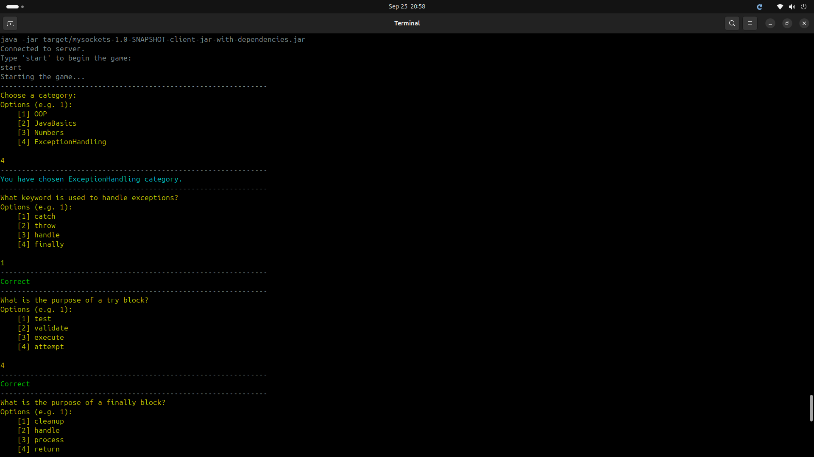

# LAN Multiplayer Quiz

This is a light weight multiplayer quiz game that can be played over a local area network (LAN). The application is built using Java. This program aids students in practice for multiple choice questions and provides feedback to users on their performance.

## Output

## Project Status 
1. Current completed features:
    - Multiplayer over LAN
    - Score tracking and reviews
    - Database question functionality
    - Llama3 integration in question explanation

2. Additional features looking to develop:
    - Leaderboard

## System Requirements:

- A linux operating system
- JDK 22 or higher
- Maven
- Access to a terminal that supports ANSI colors and Unicode characters

## Additional requirements:
- Internet access
- Groq API key

## Getting Started

1. Clone the repository: `git clone https://github.com/NkosiMlaba/lan-multiplayer-quiz`
2. Install dependencies: [setup](#setup)
3. Compile and test the project: [compile](#compiling-and-testing-the-project)
4. Running instructions: [run](#running-the-program)

#### Additional Setup Instructions (If intending to host the Server):
1. Insert your Groq API key:
    `create a file called .env in the root directory of the project and add your Groq API key to the file`

## Compiling and Testing the Project
1. Navigate to the root directory of the project: `lan-multiplayer-quiz`
2. Compile the project using: 
        
        mvn clean compile
3. Run the tests using:
        
        mvn test

#### Running the Server

        make server

#### Running the Client

        make client

## How to use the program

1. One player will be designated as the host and will create a new game room.
2. Other players can join the game room by entering the address provided by the host.
3. Each player can start the game once joined.
4. Questions will be displayed one by one, and players will have a limited time to answer each question.
5. Players' scores will be updated after each question, and the final scores will be displayed at the end of the game.
6. At the end of the game the player can review their scores and answers to the questions
7. The player can then ask for an explanation on the answers they got wrong.

## Features

- Multiplayer over LAN
- Real-time server updates
- Asking Meta AI for an explanation

## Contributing

Contributions are welcome! If you find any issues or have suggestions for improvements, please open an issue or submit a pull request.

## Contributor

Nkosikhona Mlaba (nkosimlaba397@gmail.com)

## License

This project is licensed under the MIT License.
